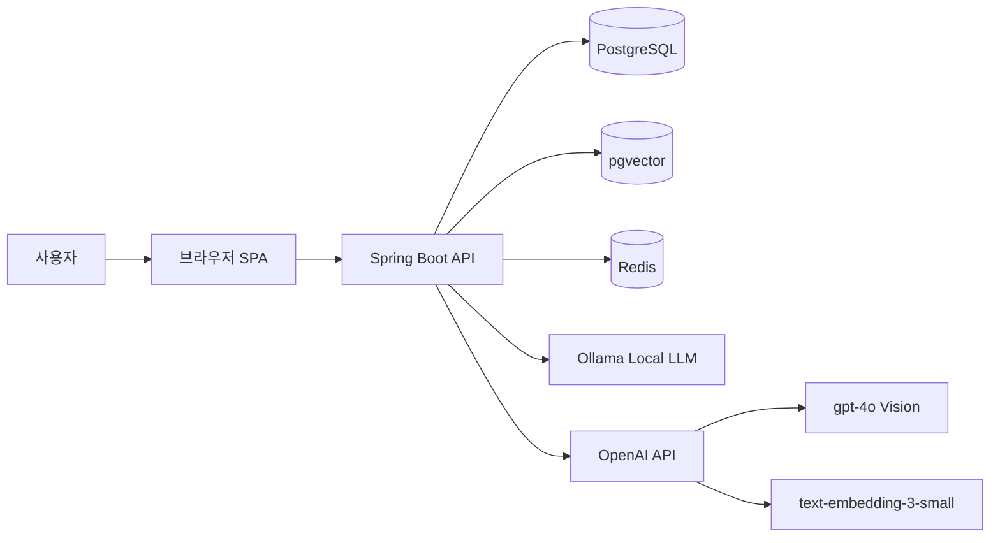
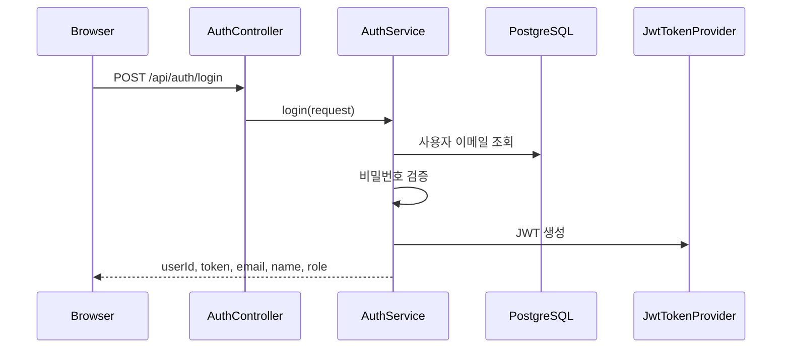
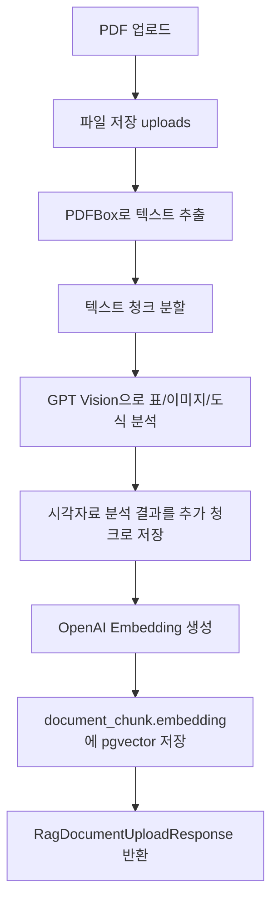
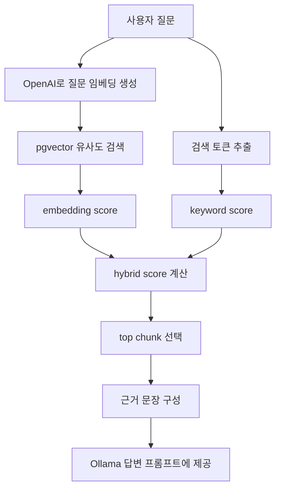
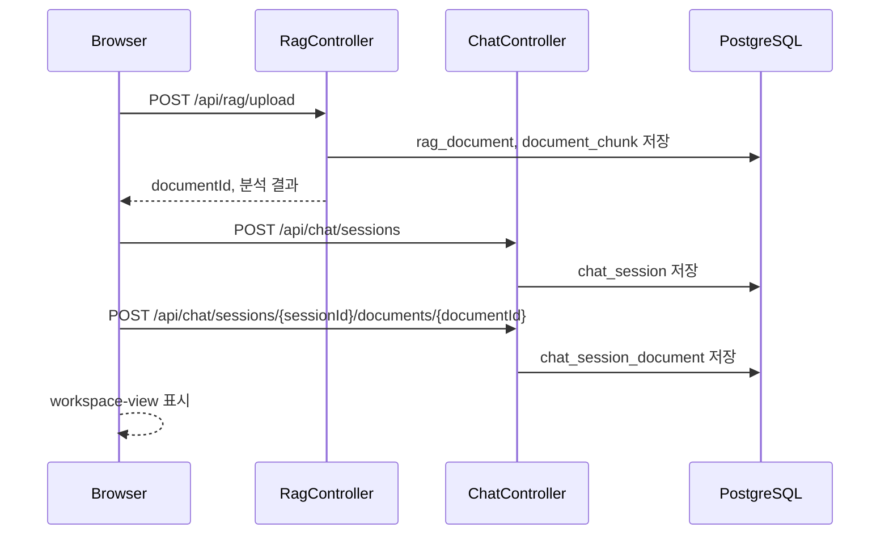
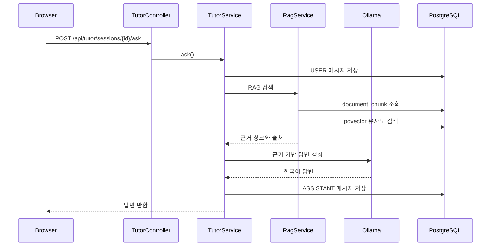
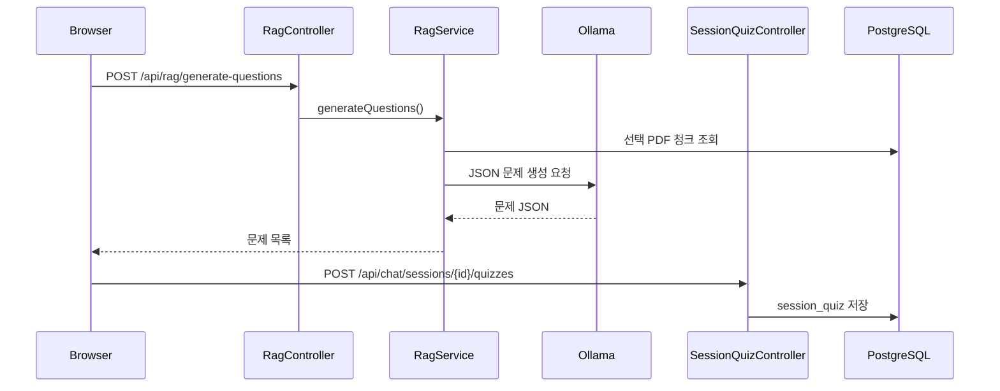

# AI Tutor 프로젝트 보고서

작성 기준: 현재 로컬 코드 기준  
DB 검증 기준: 2026-06-10 로컬 PostgreSQL `ai_tutor` 확인 결과  
프로젝트 위치: `C:\Users\c\Desktop\ai-tutor-github`  
백엔드: Spring Boot 3.5.13 / Java 17  
프론트엔드: 정적 HTML, CSS, JavaScript SPA  
주요 AI 구성: Ollama 로컬 LLM, OpenAI GPT Vision, OpenAI Embedding, PostgreSQL pgvector

## 1. 프로젝트 개요

이 프로젝트는 컴퓨터공학 학습자가 PDF 자료를 업로드하면, 해당 자료를 기반으로 AI 튜터와 대화하고, 학습 코스를 만들고, 퀴즈를 생성해서 풀 수 있도록 만든 PDF 기반 RAG 학습 시스템이다.

핵심 기능은 다음과 같다.

- 사용자 로그인과 회원가입
- PDF 업로드
- PDF 텍스트 추출
- PDF 표, 이미지, 도식 분석
- 문서 청크 분할
- OpenAI 임베딩 생성
- PostgreSQL pgvector에 벡터 저장
- 벡터 검색과 키워드 검색을 결합한 RAG 검색
- Ollama 로컬 LLM을 이용한 튜터 답변 생성
- `!학습코스` 명령어를 통한 학습 코스 생성
- PDF 기반 퀴즈 생성
- 퀴즈 풀이, 정답 확인, 다시 풀기
- 세션별 문서, 대화, 퀴즈 기록 저장

이 프로젝트는 단순히 PDF를 업로드하는 앱이 아니라, PDF 내용을 청크로 나누고 임베딩을 생성하여 pgvector에 저장한 뒤, 질문 시 관련 청크를 검색해서 LLM에게 근거로 제공하는 RAG 구조를 가진다.

## 2. 전체 시스템 구조



역할은 다음과 같이 분리된다.

| 구성 요소 | 역할 |
|---|---|
| `index.html` | 화면 구조 정의 |
| `app.css` | 전체 UI 스타일과 반응형 레이아웃 |
| `app.js` | 화면 전환, API 호출, 상태 관리, 이벤트 처리 |
| Spring Boot | REST API, 인증, RAG, 튜터, 퀴즈, DB 처리 |
| PostgreSQL | 사용자, 세션, 문서, 청크, 메시지, 퀴즈 저장 |
| pgvector | 문서 청크 임베딩 벡터 저장 및 유사도 검색 |
| Redis | 오답 기록, 약점 분석, 학습 챕터 캐시 |
| Ollama | 로컬 LLM 기반 답변, 학습코스, 문제 생성 |
| OpenAI GPT Vision | PDF 안의 표, 이미지, 도식 분석 |
| OpenAI Embedding | PDF 청크를 벡터로 변환 |

## 3. 코드 폴더 구조

주요 구조는 다음과 같다.

```text
src/main/java/com/gyeongtaekim/ai_tutor
├── AiTutorApplication.java
├── config
├── controller
├── domain
├── dto
├── repository
├── security
└── service

src/main/resources
├── application.properties
├── sql
└── static
    ├── index.html
    ├── app.css
    └── app.js
```

각 패키지의 역할은 다음과 같다.

| 패키지 | 설명 |
|---|---|
| `config` | 보안 설정, Redis 설정, pgvector 스키마 초기화, 테스트 계정 생성 |
| `controller` | REST API 엔드포인트 |
| `domain` | JPA 엔티티, DB 테이블 구조 |
| `dto` | API 요청/응답 객체 |
| `repository` | JPA Repository 및 pgvector JDBC 검색 |
| `security` | JWT 인증 필터, 토큰 발급, 사용자 인증 |
| `service` | 실제 비즈니스 로직, RAG, LLM 호출, 퀴즈 생성 |
| `static` | 브라우저에서 실행되는 프론트엔드 |

## 4. 주요 백엔드 구조

### 4.1 인증 구조

관련 파일:

- `AuthController.java`
- `AuthService.java`
- `SecurityConfig.java`
- `JwtAuthenticationFilter.java`
- `JwtTokenProvider.java`
- `User.java`

인증 흐름은 다음과 같다.



기본 테스트 계정은 `TestAccountInitializer.java`에서 생성된다.

```text
email: demo@example.com
password: secret123
role: ADMIN
```

### 4.2 RAG 문서 처리 구조

관련 파일:

- `RagController.java`
- `RagService.java`
- `PdfVisualAnalysisService.java`
- `RagDocument.java`
- `DocumentChunk.java`
- `DocumentChunkRepository.java`
- `PgVectorChunkSearchRepository.java`
- `PgVectorSchemaInitializer.java`

PDF 업로드 흐름은 다음과 같다.



`RagService.processPdf()`에서 실제 처리가 진행된다.

처리 순서는 다음과 같다.

1. 업로드 파일을 `uploads` 폴더에 저장한다.
2. PDFBox로 PDF 텍스트를 추출한다.
3. LangChain4j `DocumentSplitters`로 텍스트를 청크 단위로 나눈다.
4. 이미지, 표, 도식이 있는 페이지는 `PdfVisualAnalysisService`가 OpenAI GPT Vision으로 분석한다.
5. 일반 텍스트 청크와 시각자료 분석 청크를 `document_chunk` 테이블에 저장한다.
6. OpenAI Embedding 모델로 각 청크 임베딩을 생성한다.
7. 생성된 벡터를 pgvector 컬럼인 `document_chunk.embedding`에 저장한다.
8. 업로드 문서의 과목, 단원, 태그, 난이도, 신뢰도를 분석한다.

### 4.3 실제 벡터 DB 사용 여부

이 프로젝트는 pgvector 기반 벡터 DB 구조를 실제로 구현하고 있다.

관련 코드:

- `PgVectorSchemaInitializer.java`
- `PgVectorChunkSearchRepository.java`
- `RagService.storeChunkEmbeddings()`
- `RagService.retrieveWithPgVector()`
- `src/main/resources/sql/pgvector_document_chunk_embedding.sql`

pgvector 스키마는 다음과 같다.

```sql
CREATE EXTENSION IF NOT EXISTS vector;

ALTER TABLE document_chunk
ADD COLUMN IF NOT EXISTS embedding vector(1536);

CREATE INDEX IF NOT EXISTS idx_document_chunk_embedding
ON document_chunk
USING ivfflat (embedding vector_cosine_ops)
WITH (lists = 100);
```

`vector(1536)`을 쓰는 이유는 기본 임베딩 모델이 `text-embedding-3-small`이고, 이 모델의 기본 임베딩 차원이 1536이기 때문이다.

질문 검색 시에는 다음 SQL 구조로 벡터 유사도 검색을 수행한다.

```sql
select id, 1 - (embedding <=> cast(:queryEmbedding as vector)) as score
from document_chunk
where embedding is not null
order by embedding <=> cast(:queryEmbedding as vector)
limit :limit
```

정리하면 다음과 같다.

| 항목 | 현재 상태 |
|---|---|
| 벡터 DB 구현 | 구현되어 있음 |
| 사용하는 벡터 DB | PostgreSQL pgvector |
| 저장 위치 | `document_chunk.embedding` |
| 벡터 차원 | 1536 |
| 검색 방식 | cosine distance 기반 유사도 검색 |
| 인덱스 | ivfflat `vector_cosine_ops` |
| Redis를 벡터 DB로 사용 | 아님 |

현재 로컬 DB에서 실제 확인한 결과는 다음과 같다.

| 검증 항목 | 확인 결과 |
|---|---|
| PostgreSQL DB | `ai_tutor` 연결 확인 |
| pgvector extension | 존재함, `count=1` |
| `document_chunk.embedding` 컬럼 | 존재함, `count=1` |
| 전체 청크 수 | `843` |
| 임베딩 저장 청크 수 | `836` |
| pgvector 거리 연산자 `<=>` | 실행 확인, 자기 자신 비교 `self_score=1` |

따라서 현재 로컬 실행 환경 기준으로는 단순히 코드만 추가된 상태가 아니라, 실제 DB에 pgvector 확장과 embedding 컬럼이 존재하고, 대부분의 문서 청크에 임베딩 값이 저장되어 있으며, pgvector 거리 연산자도 정상 실행되는 것을 확인했다.

주의할 점은 OpenAI API 키가 없으면 신규 업로드 문서의 임베딩 생성이 비활성화될 수 있다는 것이다. 이 경우 pgvector 검색 대신 키워드 기반 검색과 fallback 로직이 동작할 수 있다. 따라서 다른 환경에서 시연할 때는 `OPENAI_API_KEY`가 설정되어 있고, 업로드 후 `document_chunk.embedding`에 값이 들어갔는지 다시 확인하는 것이 중요하다.

확인 SQL:

```sql
select count(*) as total_chunks from document_chunk;
select count(*) as embedded_chunks from document_chunk where embedding is not null;
select extname from pg_extension where extname = 'vector';
```

### 4.4 RAG 검색 구조

질문이 들어오면 `RagService.query()`가 실행된다.

검색 흐름은 다음과 같다.



현재 RAG 검색은 단순 벡터 검색만 쓰지 않는다. 벡터 검색 점수와 키워드 점수를 결합한다.

```text
최종 점수 = embedding score * 0.65 + keyword score * 0.35
```

이 방식은 다음 장점이 있다.

- 의미적으로 비슷한 문장을 찾는 벡터 검색 장점 활용
- PDF 안의 특정 용어, 단원명, 키워드가 정확히 등장하는 경우 키워드 검색으로 보완
- pgvector가 실패하거나 API 키가 없을 때도 완전히 멈추지 않고 키워드 기반 fallback 가능

## 5. LLM과 AI 모델 사용 구조

이 프로젝트는 로컬 LLM과 OpenAI API를 역할별로 나눠서 사용한다.

### 5.1 Ollama 로컬 LLM

관련 파일:

- `OllamaService.java`
- `TutorService.java`
- `RagService.java`
- `service/question/*`

기본 설정:

```properties
ollama.enabled=${OLLAMA_ENABLED:true}
ollama.base-url=${OLLAMA_BASE_URL:http://localhost:11434}
ollama.chat.model=${OLLAMA_CHAT_MODEL:qwen2.5:7b}
ollama.temperature=${OLLAMA_TEMPERATURE:0.1}
```

기본 로컬 LLM 모델은 다음이다.

```text
qwen2.5:7b
```

Ollama는 다음 기능에 사용된다.

| 기능 | 사용 여부 |
|---|---|
| 일반 튜터 답변 | 사용 |
| `!학습코스` 생성 | 사용 |
| 문제/퀴즈 생성 | 사용 |
| PDF 과목/단원/태그 분석 보정 | 사용 |
| 퀴즈 생성 전 깨끗한 학습 노트 생성 | 사용 |

즉, 학습코스와 문제는 로컬 LLM인 Ollama `qwen2.5:7b`를 우선 사용해서 만든다고 설명할 수 있다. 단, Ollama가 꺼져 있거나 응답에 실패하면 코드 내부의 규칙 기반 fallback이 동작한다.

### 5.2 OpenAI GPT Vision

관련 파일:

- `PdfVisualAnalysisService.java`

기본 설정:

```properties
openai.vision.model=${OPENAI_VISION_MODEL:gpt-4o}
openai.vision.enabled=${OPENAI_VISION_ENABLED:true}
openai.vision.max-pages=${OPENAI_VISION_MAX_PAGES:5}
```

GPT Vision은 PDF의 모든 텍스트 답변 생성에 쓰이는 것이 아니다. 역할은 PDF 안의 표, 이미지, 차트, 도식 같은 시각자료를 분석하는 것이다.

처리 방식:

1. PDF 페이지를 이미지로 렌더링한다.
2. 해당 페이지가 이미지나 표 형태로 보이면 OpenAI Chat Completions API로 보낸다.
3. GPT Vision이 표/이미지/도식 내용을 JSON으로 정리한다.
4. 반환된 설명, 요약, 키워드를 별도 청크로 저장한다.
5. 이 청크도 일반 텍스트 청크처럼 RAG 검색과 문제 생성에 활용된다.

즉, “이미지나 표를 텍스트 데이터로 정형화해서 로컬 LLM이 활용할 수 있게 하는 구조”가 구현되어 있다.

### 5.3 OpenAI Embedding

관련 파일:

- `RagService.java`
- `PgVectorChunkSearchRepository.java`

기본 설정:

```properties
openai.embedding.model=${OPENAI_EMBEDDING_MODEL:text-embedding-3-small}
```

OpenAI Embedding은 다음에 사용된다.

- PDF 텍스트 청크 임베딩 생성
- GPT Vision 결과 청크 임베딩 생성
- 사용자 질문 임베딩 생성
- pgvector 유사도 검색

임베딩이 있어야 의미 기반 벡터 검색이 가능하다. 따라서 RAG 품질을 위해 `OPENAI_API_KEY`는 중요하다.

### 5.4 OpenAI와 로컬 LLM의 역할 구분

| 구분 | 사용 모델 | 역할 |
|---|---|---|
| 튜터 답변 | Ollama `qwen2.5:7b` | RAG 근거를 바탕으로 한국어 답변 생성 |
| 학습코스 | Ollama `qwen2.5:7b` | 선택 PDF 1개 기준 학습 순서 생성 |
| 문제 생성 | Ollama `qwen2.5:7b` | 객관식, 주관식, O/X 문제 생성 |
| PDF 표/이미지 분석 | OpenAI `gpt-4o` | 시각자료를 JSON 형태 학습 텍스트로 정리 |
| 벡터 임베딩 | OpenAI `text-embedding-3-small` | 청크와 질문을 벡터로 변환 |

## 6. Redis 사용 구조

관련 파일:

- `RedisConfig.java`
- `LearningSessionService.java`
- `WrongAnswerService.java`
- `WeaknessAnalysisService.java`

Redis는 벡터 DB가 아니다.

이 프로젝트에서 Redis는 다음 용도로 쓰인다.

| 기능 | Redis 사용 |
|---|---|
| 챕터 목록 캐시 | `LearningSessionService` |
| 오답 저장 | `WrongAnswerService` |
| 약점 분석 | `WeaknessAnalysisService` |

오답 키 구조:

```text
user:{userId}:wrongAnswers
```

정리하면 다음과 같다.

- 벡터 DB: PostgreSQL pgvector
- 오답/캐시 저장: Redis
- 영구 데이터 저장: PostgreSQL

## 7. 데이터베이스 구조

주요 테이블은 JPA 엔티티 기준으로 생성된다.

### 7.1 사용자와 인증

| 테이블 | 설명 |
|---|---|
| `user` 또는 `users` 계열 | 사용자 이메일, 비밀번호, 이름, 권한 저장 |

### 7.2 문서와 RAG

| 테이블 | 주요 필드 | 설명 |
|---|---|---|
| `rag_document` | `id`, `title`, `sourceType`, `trustLevel`, `subject`, `unitName`, `storedFileName`, `extractedText`, `createdAt` | 업로드된 PDF 문서 정보 |
| `document_chunk` | `id`, `document_id`, `chunkIndex`, `chunkText`, `metadata`, `embedding` | PDF 청크와 벡터 저장 |

`document_chunk.embedding`은 JPA 엔티티에는 직접 필드로 선언되어 있지 않고, `PgVectorSchemaInitializer`가 SQL로 추가한다.

### 7.3 채팅과 세션

| 테이블 | 주요 필드 | 설명 |
|---|---|---|
| `chat_session` | `id`, `user_id`, `title`, `status`, `type`, `createdAt`, `updatedAt` | 학습 세션 |
| `chat_message` | `id`, `session_id`, `role`, `content`, `sourceReferences`, `createdAt` | 사용자/AI 대화 내용 |
| `chat_session_document` | `session_id`, `document_id` | 세션과 PDF 문서 연결 |
| `learning_memory` | `user_id`, `weakConceptSummary`, `historySummary`, `preferences` | 사용자 학습 메모리 |

### 7.4 퀴즈

| 테이블 | 주요 필드 | 설명 |
|---|---|---|
| `session_quiz` | `session_id`, `documentId`, `sourceDocumentIdsJson`, `quizSetId`, `quizSetTitle`, `question`, `choicesJson`, `correctAnswer`, `modelAnswer`, `explanation`, `sourceEvidence`, `submittedAnswer`, `correct`, `attemptCount`, `solved` | 세션별 생성 퀴즈와 풀이 기록 |

## 8. API 구조

### 8.1 인증 API

| Method | URL | 설명 |
|---|---|---|
| `POST` | `/api/auth/signup` | 회원가입 |
| `POST` | `/api/auth/login` | 로그인 및 JWT 발급 |

### 8.2 채팅 세션 API

| Method | URL | 설명 |
|---|---|---|
| `POST` | `/api/chat/sessions` | 새 학습 세션 생성 |
| `GET` | `/api/chat/sessions?userId={id}` | 사용자 세션 목록 조회 |
| `GET` | `/api/chat/sessions/{sessionId}` | 세션 상세 조회 |
| `GET` | `/api/chat/sessions/{sessionId}/messages` | 세션 메시지 조회 |
| `PATCH` | `/api/chat/sessions/{sessionId}` | 세션 이름 변경 |
| `DELETE` | `/api/chat/sessions/{sessionId}` | 세션 삭제 |
| `POST` | `/api/chat/sessions/{sessionId}/documents/{documentId}` | 세션에 문서 연결 |

### 8.3 RAG API

| Method | URL | 설명 |
|---|---|---|
| `GET` | `/api/rag/documents` | 업로드 문서 목록 |
| `POST` | `/api/rag/upload` | PDF 업로드, 청크화, 분석, 임베딩 |
| `POST` | `/api/rag/analyze-preview` | 저장 전 PDF 분석 미리보기 |
| `GET` | `/api/rag/documents/{documentId}/analysis` | 문서 분석 결과 조회 |
| `PATCH` | `/api/rag/documents/{documentId}` | 문서 제목 수정 |
| `PATCH` | `/api/rag/documents/{documentId}/metadata` | 과목, 단원, 신뢰도 수정 |
| `DELETE` | `/api/rag/documents/{documentId}` | 문서 삭제 |
| `POST` | `/api/rag/generate-questions` | PDF 기반 문제 생성 |

### 8.4 튜터 API

| Method | URL | 설명 |
|---|---|---|
| `POST` | `/api/tutor/sessions/{sessionId}/ask` | 질문 처리, RAG 검색, LLM 답변 생성 |

특수 명령어:

| 명령어 | 설명 |
|---|---|
| `!도움말` | 사용 방법 안내 |
| `!학습코스` | 선택된 PDF 1개 기준 학습 코스 생성 |

### 8.5 퀴즈 API

| Method | URL | 설명 |
|---|---|---|
| `GET` | `/api/chat/sessions/{sessionId}/quizzes` | 세션 퀴즈 목록 조회 |
| `POST` | `/api/chat/sessions/{sessionId}/quizzes` | 생성된 퀴즈 저장 |
| `PATCH` | `/api/chat/sessions/{sessionId}/quizzes/{quizSetId}` | 퀴즈 세트 이름 변경 |
| `DELETE` | `/api/chat/sessions/{sessionId}/quizzes/{quizSetId}` | 퀴즈 세트 삭제 |
| `POST` | `/api/chat/sessions/{sessionId}/quizzes/{quizId}/submit` | 정답 제출 |
| `POST` | `/api/chat/sessions/{sessionId}/quizzes/{quizId}/reset` | 개별 문제 초기화 |

## 9. 프론트엔드 페이지 구조

프론트는 `index.html` 하나 안에 여러 화면을 넣고, `app.js`의 `showView(name)`으로 화면을 전환하는 SPA 구조다.

화면은 다음 4개다.

```javascript
const views = {
  auth: document.getElementById("auth-view"),
  home: document.getElementById("home-view"),
  workspace: document.getElementById("workspace-view"),
  quiz: document.getElementById("quiz-view"),
};
```

### 9.1 로그인 화면

ID:

```text
auth-view
```

기능:

- 로그인
- 회원가입
- 피드백 제출
- 서버 연결 상태 표시

### 9.2 홈 화면

ID:

```text
home-view
```

구성:

- 상단 통계 카드
- 공부 목록
- 새 공부 시작 카드
- 최근 대화 기록

현재 홈 화면 표시 정책:

- 공부 목록은 페이지당 7개 표시
- 최근 대화 기록은 최대 3개 표시
- 왼쪽 공부 목록 카드 높이는 오른쪽 `새 공부 시작 + 최근 대화 기록` 컬럼 높이에 맞춰 보이도록 CSS grid stretch를 사용

관련 코드:

- `renderSessionList()`
- `renderSessionPagination()`
- `renderHomeDashboard()`
- `fetchHomeActivityMetrics()`

### 9.3 학습 워크스페이스 화면

ID:

```text
workspace-view
```

구성:

- 왼쪽: PDF 업로드, PDF 목록, 문서 분석 결과
- 가운데: AI 튜터 채팅
- 오른쪽: 퀴즈 생성, 최근 생성 퀴즈 목록

주요 사용 흐름:

1. PDF를 업로드한다.
2. 업로드된 PDF가 문서 목록에 표시된다.
3. PDF를 선택한다.
4. 처음 학습할 경우 채팅창에 `!학습코스`를 입력한다.
5. 일반 질문은 자연어로 입력한다.
6. 오른쪽에서 PDF 기반 퀴즈를 생성한다.

### 9.4 퀴즈 풀이 화면

ID:

```text
quiz-view
```

기능:

- 퀴즈 세트 진입
- 이전/다음 문제 이동
- 정답 확인
- 풀이 결과 표시
- 퀴즈 재시도

## 10. 주요 사용자 흐름

### 10.1 새 PDF 학습 시작



### 10.2 튜터 질문



### 10.3 퀴즈 생성



## 11. 실행 방법

### 11.1 필수 준비물

필수 또는 권장 실행 요소:

| 항목 | 필요 여부 | 설명 |
|---|---|---|
| Java 17 | 필수 | Spring Boot 실행 |
| PostgreSQL | 필수 | 메인 DB |
| pgvector | RAG 벡터 검색에 필요 | 벡터 저장 및 검색 |
| Redis | 권장/설정상 필요 | 오답, 약점, 챕터 캐시 |
| Ollama | 로컬 LLM 사용에 필요 | 튜터, 학습코스, 문제 생성 |
| OpenAI API Key | RAG 품질에 중요 | GPT Vision, Embedding |

### 11.2 PostgreSQL 준비

DB 예시:

```sql
CREATE DATABASE ai_tutor;
CREATE USER ai_tutor WITH PASSWORD 'change-this-db-password';
GRANT ALL PRIVILEGES ON DATABASE ai_tutor TO ai_tutor;
```

pgvector 확장:

```sql
CREATE EXTENSION IF NOT EXISTS vector;
```

앱도 실행 시 `PgVectorSchemaInitializer`를 통해 다음을 시도한다.

- `create extension if not exists vector`
- `document_chunk.embedding vector(1536)` 컬럼 추가
- `idx_document_chunk_embedding` ivfflat 인덱스 생성

단, DB 사용자에게 extension 생성 권한이 없으면 수동 설치가 필요하다.

### 11.3 Ollama 준비

```powershell
ollama pull qwen2.5:7b
ollama serve
```

Ollama 기본 주소:

```text
http://localhost:11434
```

### 11.4 환경 변수 설정

PowerShell 현재 창에 설정하는 예시:

```powershell
$env:OPENAI_API_KEY=[Environment]::GetEnvironmentVariable("OPENAI_API_KEY","User")
$env:DB_USERNAME="ai_tutor"
$env:DB_PASSWORD="change-this-db-password"
$env:SPRING_DATASOURCE_URL="jdbc:postgresql://localhost:5432/ai_tutor"
$env:SPRING_DATA_REDIS_HOST="localhost"
$env:SPRING_DATA_REDIS_PORT="6379"
$env:OLLAMA_BASE_URL="http://localhost:11434"
$env:OLLAMA_CHAT_MODEL="qwen2.5:7b"
```

`application.properties`는 기본적으로 다음 값을 사용한다.

```properties
spring.datasource.url=jdbc:postgresql://localhost:5432/ai_tutor
spring.datasource.username=${DB_USERNAME:ai_tutor}
spring.datasource.password=${DB_PASSWORD:}
openai.api.key=${OPENAI_API_KEY:}
ollama.chat.model=${OLLAMA_CHAT_MODEL:qwen2.5:7b}
```

즉, DB 계정은 `DB_USERNAME`, `DB_PASSWORD`로 넣는 방식이 가장 직접적이다. `SPRING_DATASOURCE_URL`은 DB 주소를 바꾸고 싶을 때 사용한다.

### 11.5 서버 실행

프로젝트 루트에서 실행:

```powershell
.\gradlew.bat bootRun
```

정상 실행 후 접속:

```text
http://localhost:8080
```

기본 로그인:

```text
demo@example.com
secret123
```

### 11.6 외부 접속 시

다른 와이파이에서 접속해야 하는 시연 상황이면 localtunnel 같은 터널링 도구를 사용할 수 있다.

예시:

```powershell
npx localtunnel --port 8080
```

단, 외부 접속은 보안상 임시 시연 용도로만 사용하는 것이 좋다.

## 12. 실제 구현 여부 요약

| 질문 | 답변 |
|---|---|
| RAG를 사용했는가 | 예. PDF 청크 검색 결과를 LLM 프롬프트 근거로 사용한다. |
| 벡터 DB를 구현했는가 | 예. PostgreSQL pgvector를 사용한다. |
| Redis가 벡터 DB인가 | 아니다. Redis는 오답/캐시 용도다. |
| 로컬 LLM을 사용하는가 | 예. Ollama `qwen2.5:7b`가 튜터, 학습코스, 문제 생성에 사용된다. |
| GPT 모델은 어디에 쓰이는가 | GPT Vision은 PDF 표/이미지/도식 분석에, OpenAI Embedding은 벡터 생성에 사용된다. |
| 이미지/표가 RAG에 반영되는가 | 예. GPT Vision 분석 결과를 텍스트 청크로 저장하고 임베딩 대상에 포함한다. |
| OpenAI API Key가 필요한가 | 예. GPT Vision과 Embedding에 필요하다. 없으면 벡터 검색 품질이 떨어진다. |
| pgvector가 없으면 어떻게 되는가 | 앱은 예외를 무시하고 fallback할 수 있지만, 벡터 DB 사용이라고 시연하려면 pgvector 설치와 embedding 저장 확인이 필요하다. |

## 13. 시연 확인 체크리스트

시연 전에 다음을 확인하면 좋다.

### 13.1 서버 상태

```powershell
.\gradlew.bat --no-daemon classes
.\gradlew.bat bootRun
```

### 13.2 Ollama 상태

```powershell
ollama list
ollama run qwen2.5:7b
```

### 13.3 PostgreSQL pgvector 상태

```sql
select extname from pg_extension where extname = 'vector';
select count(*) from document_chunk;
select count(*) from document_chunk where embedding is not null;
```

### 13.4 OpenAI API Key 상태

```powershell
echo $env:OPENAI_API_KEY
```

값이 비어 있으면 GPT Vision과 Embedding이 동작하지 않는다.

### 13.5 실제 RAG 동작 확인

1. PDF를 업로드한다.
2. DB에서 `document_chunk`가 생성됐는지 확인한다.
3. `embedding is not null` 청크가 있는지 확인한다.
4. 채팅에서 PDF 내용 관련 질문을 한다.
5. 답변 하단에 출처가 표시되는지 확인한다.
6. `!학습코스`를 입력해서 선택 PDF 기반 학습 코스가 생성되는지 확인한다.
7. 퀴즈 생성 버튼으로 문제를 만든다.

## 14. 보고서용 결론 문장

이 프로젝트는 PDF 학습 자료를 업로드하면 PDF 텍스트와 시각자료를 청크로 변환하고, OpenAI Embedding을 이용해 각 청크를 벡터화한 뒤 PostgreSQL pgvector에 저장한다. 사용자가 질문하면 질문도 임베딩하여 pgvector에서 관련 청크를 검색하고, 검색된 근거를 Ollama 로컬 LLM `qwen2.5:7b`에 제공하여 한국어 튜터 답변, 학습 코스, 퀴즈를 생성한다. GPT 모델은 일반 답변 생성을 담당하지 않고, PDF 내 표/이미지/도식 분석과 임베딩 생성에 사용되며, Redis는 벡터 DB가 아니라 오답 기록과 약점 분석을 위한 보조 저장소로 사용된다. 따라서 본 프로젝트는 RAG 구조와 벡터 DB를 구현한 로컬 LLM 기반 AI 튜터 시스템이라고 설명할 수 있다.
