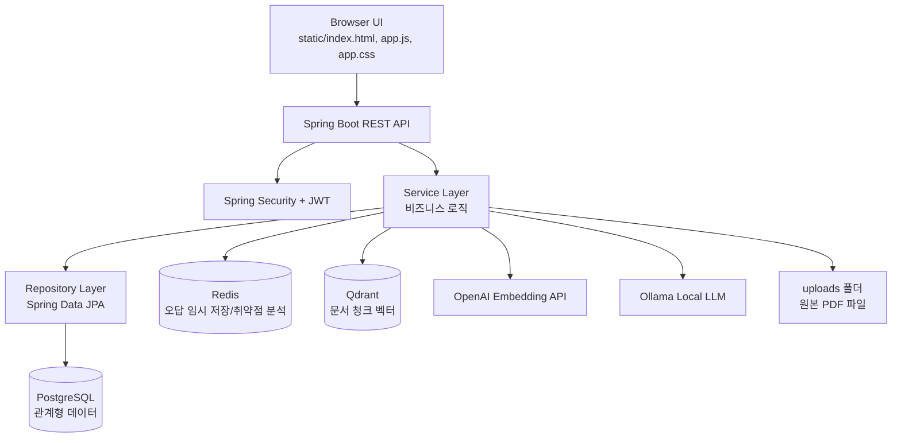
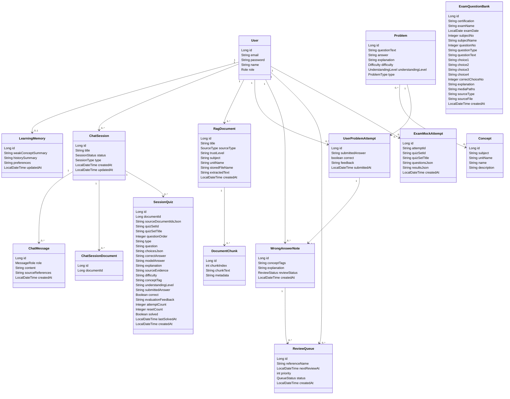
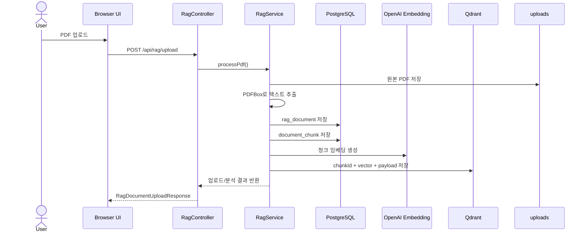
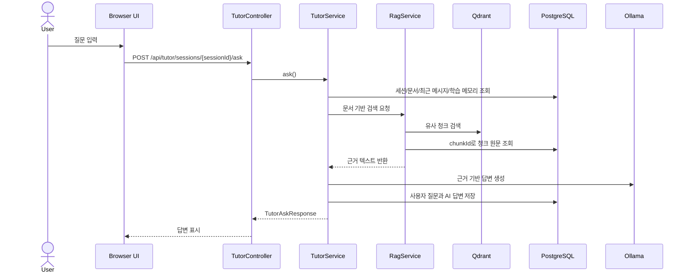
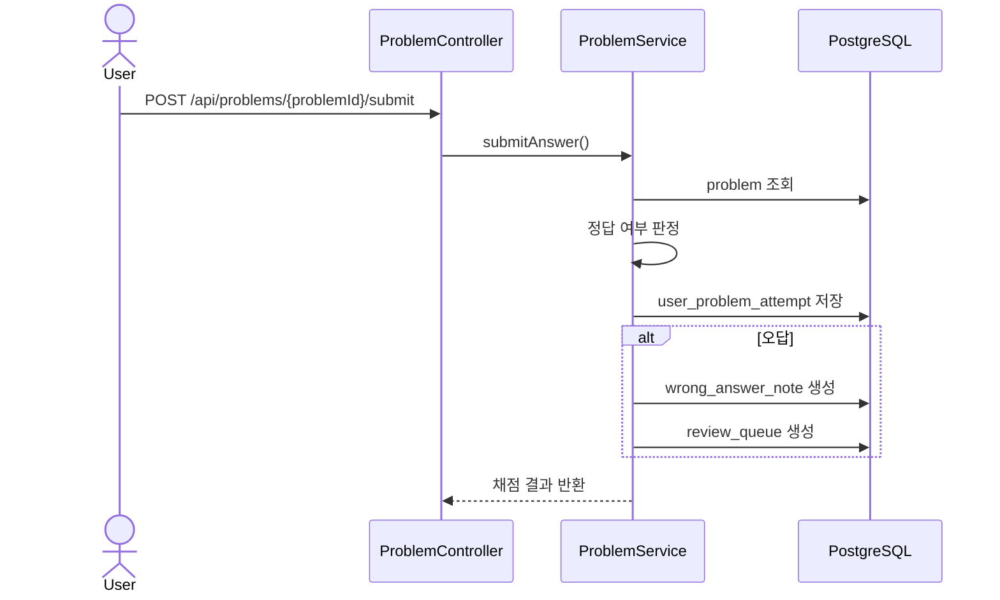

# AI Tutor UML 및 데이터베이스 스키마 설계 문서

최종 작성일: 2026-08-30

이 문서는 `ai-tutor` 프로젝트의 객체 구성, UML 설계도, 데이터베이스 스키마 설계도, 기능별 객체와 테이블 역할을 정리한 문서이다.  
현재 프로젝트는 Spring Boot 기반 REST API 서버이며, PostgreSQL은 관계형 데이터 저장소, Redis는 오답/취약점 분석용 보조 저장소, Qdrant는 PDF 청크 임베딩 벡터 저장소로 사용한다.

## 1. 프로젝트 개요

AI Tutor는 사용자가 PDF 학습 자료를 업로드하고, 해당 문서 기반으로 질문 응답, 퀴즈 생성, 채팅 학습, 오답 관리, 복습 큐, 모의고사 풀이 기록을 관리하는 개인 학습 튜터 서비스이다.

주요 기능은 다음과 같다.

- 사용자 회원가입, 로그인, JWT 인증
- PDF 업로드 및 텍스트 추출
- PDF 문서 청크 저장 및 벡터 검색
- RAG 기반 질의응답
- 채팅 세션 및 메시지 관리
- 채팅 세션에 문서 연결
- 문서 기반 퀴즈 생성 및 세션별 퀴즈 저장
- 개념, 문제, 사용자 풀이 기록 저장
- 오답노트 및 복습 큐 관리
- Redis 기반 임시 오답 저장 및 취약점 분석
- 정보처리기사 기출 모의고사 문제 은행 및 풀이 기록 관리

## 2. 전체 아키텍처 구성도



## 3. 패키지별 객체 구성

### 3.1 config

설정 및 애플리케이션 시작 시 필요한 초기화 로직을 담당한다.

- `SecurityConfig`: Spring Security, JWT 필터, 공개 API 경로, 인증 정책 설정
- `RedisConfig`: RedisTemplate 설정
- `TestAccountInitializer`: 데모 계정 자동 생성 및 권한 설정
- `ChatSessionSchemaInitializer`: 기존 `chat_session` 테이블에 `type` 컬럼 보정
- `PdfTextSchemaInitializer`: PostgreSQL에서 긴 PDF 텍스트 컬럼을 `TEXT` 타입으로 보정
- `SessionQuizSchemaInitializer`: 기존 `session_quiz` 테이블의 누락 컬럼 추가 및 기본값 보정
- `RagDocumentOwnerSchemaInitializer`: 기존 `rag_document` 데이터에 사용자 소유자 컬럼과 인덱스 보정
- `ExamQuestionBankInitializer`: `src/main/resources/exam-mocks` CSV 데이터를 `exam_question_bank` 테이블에 초기 적재

### 3.2 controller

HTTP 요청을 받아 인증 사용자 확인 후 서비스 계층으로 전달한다.

- `AuthController`: 회원가입, 로그인, 인증 상태 확인
- `UserController`: 사용자 생성 및 목록 조회
- `ChatController`: 채팅 세션, 메시지, 세션-문서 연결 관리
- `TutorController`: 채팅 세션 기반 AI 튜터 질문 처리
- `RagController`: PDF 업로드, 문서 목록, 문서 분석, RAG 질의응답, 문제 생성
- `PdfController`: 단순 PDF 업로드 엔드포인트
- `ConceptController`: 학습 개념 등록 및 조회
- `ProblemController`: 문제 생성, 문제 조회, 답안 제출
- `LearningMemoryController`: 사용자별 학습 메모리 조회 및 수정
- `SessionQuizController`: 채팅 세션별 퀴즈 저장, 제출, 초기화, 삭제
- `ReviewController`: 오답노트와 복습 큐 조회 및 복습 완료 처리
- `WrongAnswerController`: Redis 기반 오답 저장, 조회, 삭제
- `WeaknessAnalysisController`: Redis 오답 데이터를 기반으로 취약점 분석
- `ExamMockController`: 정보처리기사 모의고사 조회, 미디어 제공, 풀이 기록 저장
- `FeedbackController`: 오류/피드백 내용을 로그 파일로 저장
- `ApiExceptionHandler`: API 예외 응답 공통 처리

### 3.3 domain

JPA Entity로 DB 테이블과 직접 연결되는 핵심 객체이다.

- `User`: 사용자 계정 정보 저장
- `LearningMemory`: 사용자별 취약 개념, 학습 이력, 선호 설명 방식 저장
- `ChatSession`: 사용자별 채팅 세션 저장
- `ChatMessage`: 세션별 사용자/AI 메시지 저장
- `ChatSessionDocument`: 채팅 세션과 RAG 문서 연결 저장
- `RagDocument`: 업로드된 PDF 문서 메타데이터와 추출 텍스트 저장
- `DocumentChunk`: RAG 검색용 문서 청크 원문과 메타데이터 저장
- `Concept`: 과목/단원별 학습 개념 저장
- `Problem`: 학습 문제, 정답, 해설, 난이도, 문제 유형 저장
- `UserProblemAttempt`: 사용자의 문제 풀이 제출 기록 저장
- `WrongAnswerNote`: 오답노트 저장
- `ReviewQueue`: 복습 예정 항목 저장
- `SessionQuiz`: 채팅 세션 안에서 생성된 문서 기반 퀴즈와 풀이 상태 저장
- `ExamQuestionBank`: 정보처리기사 기출 문제 은행 저장
- `ExamMockAttempt`: 사용자의 모의고사 풀이 기록 저장

### 3.4 repository

DB 접근을 담당하는 Spring Data JPA 인터페이스이다.

- `UserRepository`: 이메일 기반 사용자 조회, 이메일 중복 확인
- `LearningMemoryRepository`: 사용자별 학습 메모리 조회
- `ChatSessionRepository`: 사용자별 채팅 세션 최신순 조회
- `ChatMessageRepository`: 세션별 메시지 시간순 조회 및 삭제
- `ChatSessionDocumentRepository`: 세션-문서 연결 조회, 중복 확인, 삭제
- `RagDocumentRepository`: 사용자별 문서 조회, 파일명/문서 ID 기반 조회
- `DocumentChunkRepository`: 문서별/사용자별 청크 조회
- `ConceptRepository`: 개념 CRUD
- `ProblemRepository`: 문제 CRUD
- `UserProblemAttemptRepository`: 문제 풀이 기록 CRUD
- `WrongAnswerNoteRepository`: 사용자별 오답노트 최신순 조회
- `ReviewQueueRepository`: 사용자별 복습 큐 조회 및 본인 소유 복습 항목 조회
- `SessionQuizRepository`: 세션별 퀴즈 세트 조회, 제출/초기화 대상 조회, 삭제
- `ExamQuestionBankRepository`: 자격증/시험일/문항번호 기준 기출 문제 조회
- `ExamMockAttemptRepository`: 사용자별 모의고사 풀이 기록 조회

### 3.5 service

비즈니스 규칙과 외부 저장소 연동을 담당한다.

- `AuthService`: 회원가입, 로그인, 비밀번호 암호화, JWT 발급
- `CurrentUserService`: 인증 객체에서 현재 사용자 식별, fallback userId 검증
- `UserService`: 사용자 생성 및 조회
- `ChatService`: 채팅 세션/메시지/문서 연결 관리
- `TutorService`: 세션 문서, 최근 대화, 학습 메모리, RAG 결과를 조합해 AI 답변 생성
- `RagService`: PDF 처리, 텍스트 추출, 청크 분할, 문서 검색, 문제 생성
- `QdrantVectorStoreService`: Qdrant 컬렉션 생성, 벡터 저장, 유사도 검색, 삭제
- `OllamaService`: 로컬 LLM 호출
- `PdfVisualAnalysisService`: PDF 시각 분석 처리
- `ConceptService`: 개념 등록 및 조회
- `ProblemService`: 문제 생성, 문제 제출, 정답 판정, 오답노트 생성
- `LearningMemoryService`: 사용자 학습 메모리 조회 및 갱신
- `ReviewService`: 오답노트 조회, 복습 큐 조회, 복습 완료 처리
- `SessionQuizService`: 채팅 세션별 퀴즈 저장, 제출, 초기화, 세트 삭제
- `WrongAnswerService`: Redis에 오답 기록 저장, 조회, 삭제
- `WeaknessAnalysisService`: Redis 오답 기록에서 취약 키워드 빈도 분석
- `ExamMockService`: CSV로 적재된 기출 문제를 모의고사 응답으로 구성
- `ExamMockAttemptService`: 사용자별 모의고사 풀이 기록 저장, 조회, 삭제

## 4. 계층 UML 설계도

```mermaid
classDiagram
    class AuthController
    class ChatController
    class RagController
    class TutorController
    class ProblemController
    class ReviewController
    class SessionQuizController
    class ExamMockController

    class AuthService
    class ChatService
    class RagService
    class TutorService
    class ProblemService
    class ReviewService
    class SessionQuizService
    class ExamMockService
    class ExamMockAttemptService
    class CurrentUserService

    class UserRepository
    class ChatSessionRepository
    class RagDocumentRepository
    class ProblemRepository
    class ReviewQueueRepository
    class SessionQuizRepository
    class ExamQuestionBankRepository

    AuthController --> AuthService
    ChatController --> ChatService
    ChatController --> CurrentUserService
    RagController --> RagService
    RagController --> CurrentUserService
    TutorController --> TutorService
    TutorController --> CurrentUserService
    ProblemController --> ProblemService
    ReviewController --> ReviewService
    SessionQuizController --> SessionQuizService
    ExamMockController --> ExamMockService
    ExamMockController --> ExamMockAttemptService
    ExamMockController --> CurrentUserService

    AuthService --> UserRepository
    ChatService --> ChatSessionRepository
    ChatService --> RagDocumentRepository
    RagService --> RagDocumentRepository
    ProblemService --> ProblemRepository
    ReviewService --> ReviewQueueRepository
    SessionQuizService --> SessionQuizRepository
    ExamMockService --> ExamQuestionBankRepository
```



## 5. 도메인 UML 클래스 다이어그램



## 6. 데이터베이스 ERD

```mermaid
erDiagram
    users ||--o| learning_memory : has
    users ||--o{ chat_session : owns
    users ||--o{ rag_document : owns
    users ||--o{ user_problem_attempt : submits
    users ||--o{ wrong_answer_note : owns
    users ||--o{ review_queue : owns
    users ||--o{ exam_mock_attempt : saves

    chat_session ||--o{ chat_message : contains
    chat_session ||--o{ chat_session_document : attaches
    chat_session ||--o{ session_quiz : contains
    rag_document ||--o{ document_chunk : splits

    problem ||--o{ user_problem_attempt : attempted_by
    user_problem_attempt ||--o| wrong_answer_note : creates
    wrong_answer_note ||--o{ review_queue : scheduled_as

    problem ||--o{ problem_concepts : maps
    concept ||--o{ problem_concepts : maps

    users {
        bigint id PK
        varchar email UK
        varchar password
        varchar name
        varchar role
    }

    learning_memory {
        bigint id PK
        bigint user_id FK_UK
        varchar weak_concept_summary
        varchar history_summary
        varchar preferences
        timestamp updated_at
    }

    chat_session {
        bigint id PK
        bigint user_id FK
        varchar title
        varchar status
        varchar type
        timestamp created_at
        timestamp updated_at
    }

    chat_message {
        bigint id PK
        bigint session_id FK
        varchar role
        text content
        varchar source_references
        timestamp created_at
    }

    chat_session_document {
        bigint id PK
        bigint session_id FK
        bigint document_id
    }

    rag_document {
        bigint id PK
        bigint user_id FK
        varchar title
        varchar source_type
        varchar trust_level
        varchar subject
        varchar unit_name
        varchar stored_file_name UK
        text extracted_text
        timestamp created_at
    }

    document_chunk {
        bigint id PK
        bigint document_id FK
        integer chunk_index
        text chunk_text
        varchar metadata
        vector embedding
    }

    concept {
        bigint id PK
        varchar subject
        varchar unit_name
        varchar name
        varchar description
    }

    problem {
        bigint id PK
        varchar question_text
        varchar answer
        varchar explanation
        varchar difficulty
        varchar understanding_level
        varchar type
    }

    problem_concepts {
        bigint problem_id FK
        bigint concept_id FK
    }

    user_problem_attempt {
        bigint id PK
        bigint user_id FK
        bigint problem_id FK
        varchar submitted_answer
        boolean correct
        varchar feedback
        timestamp submitted_at
    }

    wrong_answer_note {
        bigint id PK
        bigint user_id FK
        bigint attempt_id FK
        varchar concept_tags
        varchar explanation
        varchar review_status
        timestamp created_at
    }

    review_queue {
        bigint id PK
        bigint user_id FK
        bigint wrong_answer_note_id FK
        varchar reference_name
        timestamp next_review_at
        integer priority
        varchar status
        timestamp created_at
    }

    session_quiz {
        bigint id PK
        bigint session_id FK
        bigint document_id
        text source_document_ids_json
        varchar quiz_set_id
        varchar quiz_set_title
        integer question_order
        varchar type
        text question
        text choices_json
        text correct_answer
        text model_answer
        text explanation
        text source_evidence
        varchar difficulty
        varchar concept_tag
        varchar understanding_level
        text submitted_answer
        boolean correct
        text evaluation_feedback
        integer attempt_count
        integer reset_count
        boolean solved
        timestamp last_solved_at
        timestamp created_at
    }

    exam_question_bank {
        bigint id PK
        varchar certification
        varchar exam_name
        date exam_date
        integer subject_no
        varchar subject_name
        integer question_no
        varchar question_type
        text question_text
        text choice1
        text choice2
        text choice3
        text choice4
        integer correct_choice_no
        text explanation
        text media_paths
        varchar source_type
        varchar source_file
        timestamp created_at
    }

    exam_mock_attempt {
        bigint id PK
        bigint user_id FK
        varchar attempt_id
        varchar quiz_set_id
        varchar quiz_set_title
        text questions_json
        text results_json
        timestamp created_at
    }
```

## 7. 테이블별 구성 설명

### 7.1 User: 사용자 계정 정보 저장

사용자 인증과 개인별 데이터 소유권의 기준이 되는 테이블 그룹이다.

- `users`: 사용자 이메일, 암호화 비밀번호, 이름, 권한 저장
- `learning_memory`: 사용자별 학습 메모리 저장
- 관련 객체: `User`, `LearningMemory`
- 관련 API: `/api/auth`, `/api/users`, `/api/memory`

주요 관계:

- `users` 1 : 0..1 `learning_memory`
- `users` 1 : N `chat_session`
- `users` 1 : N `rag_document`
- `users` 1 : N `user_problem_attempt`
- `users` 1 : N `exam_mock_attempt`

### 7.2 Chat: 채팅 세션 및 대화 기록 저장

AI 튜터와의 대화 단위를 관리하는 테이블 그룹이다.

- `chat_session`: 사용자별 채팅방 또는 학습 세션 저장
- `chat_message`: 세션 안의 사용자/AI/SYSTEM 메시지 저장
- `chat_session_document`: 채팅 세션과 업로드 문서 연결 저장
- 관련 객체: `ChatSession`, `ChatMessage`, `ChatSessionDocument`
- 관련 API: `/api/chat`, `/api/tutor`

주요 관계:

- `users` 1 : N `chat_session`
- `chat_session` 1 : N `chat_message`
- `chat_session` 1 : N `chat_session_document`
- `chat_session_document.document_id`는 `rag_document.id`를 참조하는 연결 값으로 사용된다.

### 7.3 RAG Document: PDF 문서 및 검색 청크 저장

업로드된 PDF와 RAG 검색을 위한 텍스트 청크를 관리하는 테이블 그룹이다.

- `rag_document`: 문서 제목, 소유 사용자, 출처 타입, 신뢰도, 과목, 단원, 저장 파일명, 전체 추출 텍스트 저장
- `document_chunk`: 문서별 청크 번호, 청크 원문, 메타데이터 저장
- Qdrant `document_chunks` collection: `document_chunk.id`를 기준으로 임베딩 벡터와 payload 저장
- 관련 객체: `RagDocument`, `DocumentChunk`
- 관련 API: `/api/rag`

주요 관계:

- `users` 1 : N `rag_document`
- `rag_document` 1 : N `document_chunk`
- `document_chunk.id`와 Qdrant point의 `chunkId` payload가 연결된다.

Qdrant payload 구성:

- `chunkId`: PostgreSQL `document_chunk.id`
- `userId`: 문서 소유 사용자 ID
- `documentId`: PostgreSQL `rag_document.id`
- `sessionId`: 검색 또는 생성 시 연결되는 세션 ID
- `pageNumber`: PDF 페이지 번호
- `chunkIndex`: 문서 내부 청크 순서

### 7.4 Concept and Problem: 개념과 문제 저장

기본 학습 문제와 개념 태그를 관리하는 테이블 그룹이다.

- `concept`: 과목, 단원, 개념명, 설명 저장
- `problem`: 문제 본문, 정답, 해설, 난이도, 이해 수준, 문제 유형 저장
- `problem_concepts`: 문제와 개념의 다대다 연결 테이블
- `user_problem_attempt`: 사용자의 문제 제출 답안, 정답 여부, 피드백 저장
- 관련 객체: `Concept`, `Problem`, `UserProblemAttempt`
- 관련 API: `/api/concepts`, `/api/problems`

주요 관계:

- `problem` N : M `concept`
- `problem` 1 : N `user_problem_attempt`
- `users` 1 : N `user_problem_attempt`

### 7.5 Wrong Answer and Review: 오답노트와 복습 큐 저장

틀린 문제를 복습 대상으로 전환하고 복습 일정을 관리하는 테이블 그룹이다.

- `wrong_answer_note`: 사용자별 오답노트, 개념 태그, 해설, 복습 상태 저장
- `review_queue`: 다음 복습 시각, 우선순위, 복습 완료 상태 저장
- Redis `user:{userId}:wrongAnswers`: 간단한 오답 기록 리스트 저장
- 관련 객체: `WrongAnswerNote`, `ReviewQueue`, `WrongAnswerDto`
- 관련 API: `/api/reviews`, `/api/wrong-answers`, `/api/analysis`

주요 관계:

- `users` 1 : N `wrong_answer_note`
- `user_problem_attempt` 1 : 0..1 `wrong_answer_note`
- `wrong_answer_note` 1 : N `review_queue`
- Redis 오답 기록은 DB 오답노트와 별도로 취약점 분석에 사용된다.

### 7.6 Session Quiz: 채팅 세션 기반 퀴즈 저장

RAG로 생성한 퀴즈를 채팅 세션 안에 저장하고 풀이 상태를 관리하는 테이블이다.

- `session_quiz`: 퀴즈 세트 ID, 제목, 문항 순서, 문제, 선택지 JSON, 정답, 해설, 근거, 제출 답안, 채점 결과 저장
- 관련 객체: `SessionQuiz`
- 관련 API: `/api/chat/sessions/{sessionId}/quizzes`

주요 관계:

- `chat_session` 1 : N `session_quiz`
- `session_quiz.document_id`는 대표 문서 ID를 저장한다.
- `session_quiz.source_document_ids_json`은 여러 문서를 기반으로 생성된 경우 문서 ID 목록을 JSON 문자열로 저장한다.

### 7.7 Exam Mock: 정보처리기사 모의고사 저장

정보처리기사 기출 문제 은행과 사용자 풀이 기록을 관리하는 테이블 그룹이다.

- `exam_question_bank`: 자격증명, 시험명, 시험일, 과목번호, 과목명, 문항번호, 문제, 선택지, 정답, 해설, 미디어 경로 저장
- `exam_mock_attempt`: 사용자별 모의고사 풀이 기록, 제출한 문제 JSON, 결과 JSON 저장
- 관련 객체: `ExamQuestionBank`, `ExamMockAttempt`
- 관련 API: `/api/exam-mocks`

주요 관계:

- `users` 1 : N `exam_mock_attempt`
- `exam_question_bank`는 시험 회차별 정적 문제 은행이다.
- `exam_mock_attempt`는 문제 은행 자체를 수정하지 않고 사용자 풀이 결과만 JSON으로 저장한다.

### 7.8 Feedback: 피드백 로그 저장

사용자 오류 제보 또는 피드백을 파일 기반 로그로 저장한다.

- DB 테이블 없음
- 저장 위치: `run-logs/feedback-submissions.log`
- 저장 형식: JSON Lines
- 관련 객체: `FeedbackRequest`
- 관련 API: `/api/feedback`

## 8. 주요 테이블 상세 스키마

### 8.1 `users`

| 컬럼 | 타입 | 제약 | 설명 |
|---|---|---|---|
| `id` | BIGINT | PK, Auto Increment | 사용자 ID |
| `email` | VARCHAR | NOT NULL, UNIQUE | 로그인 이메일 |
| `password` | VARCHAR | NOT NULL | BCrypt 암호화 비밀번호 |
| `name` | VARCHAR | NOT NULL | 사용자 이름 |
| `role` | VARCHAR | NOT NULL | `USER`, `ADMIN` |

### 8.2 `learning_memory`

| 컬럼 | 타입 | 제약 | 설명 |
|---|---|---|---|
| `id` | BIGINT | PK | 학습 메모리 ID |
| `user_id` | BIGINT | FK, UNIQUE, NOT NULL | 사용자 ID |
| `weak_concept_summary` | VARCHAR(2000) | NOT NULL | 취약 개념 요약 |
| `history_summary` | VARCHAR(2000) | NOT NULL | 학습 이력 요약 |
| `preferences` | VARCHAR(1000) | NOT NULL | 선호 설명 방식 |
| `updated_at` | TIMESTAMP | NOT NULL | 최종 수정 시각 |

### 8.3 `chat_session`

| 컬럼 | 타입 | 제약 | 설명 |
|---|---|---|---|
| `id` | BIGINT | PK | 채팅 세션 ID |
| `user_id` | BIGINT | FK, NOT NULL | 세션 소유 사용자 |
| `title` | VARCHAR | NOT NULL | 세션 제목 |
| `status` | VARCHAR | NOT NULL | `ACTIVE`, `CLOSED` |
| `type` | VARCHAR | NOT NULL | `STUDY`, `QUIZ` |
| `created_at` | TIMESTAMP | NOT NULL | 생성 시각 |
| `updated_at` | TIMESTAMP | NOT NULL | 마지막 갱신 시각 |

### 8.4 `chat_message`

| 컬럼 | 타입 | 제약 | 설명 |
|---|---|---|---|
| `id` | BIGINT | PK | 메시지 ID |
| `session_id` | BIGINT | FK, NOT NULL | 소속 채팅 세션 |
| `role` | VARCHAR | NOT NULL | `USER`, `ASSISTANT`, `SYSTEM` |
| `content` | TEXT | NOT NULL | 메시지 본문 |
| `source_references` | VARCHAR(1000) | NULL | RAG 답변 출처 정보 |
| `created_at` | TIMESTAMP | NOT NULL | 생성 시각 |

### 8.5 `rag_document`

| 컬럼 | 타입 | 제약 | 설명 |
|---|---|---|---|
| `id` | BIGINT | PK | 문서 ID |
| `user_id` | BIGINT | FK, NULL 가능 | 문서 소유 사용자 |
| `title` | VARCHAR | NOT NULL | 문서 제목 |
| `source_type` | VARCHAR | NOT NULL | `PDF`, `NOTE`, `PROBLEM_SET` |
| `trust_level` | VARCHAR | NOT NULL | 문서 신뢰도 |
| `subject` | VARCHAR | NOT NULL | 과목 |
| `unit_name` | VARCHAR | NOT NULL | 단원 |
| `stored_file_name` | VARCHAR | NOT NULL, UNIQUE | 서버 저장 파일명 |
| `extracted_text` | TEXT | NOT NULL | PDF에서 추출한 전체 텍스트 |
| `created_at` | TIMESTAMP | NOT NULL | 생성 시각 |

### 8.6 `document_chunk`

| 컬럼 | 타입 | 제약 | 설명 |
|---|---|---|---|
| `id` | BIGINT | PK | 청크 ID |
| `document_id` | BIGINT | FK, NOT NULL | 원본 문서 ID |
| `chunk_index` | INTEGER | NOT NULL | 문서 내부 청크 순서 |
| `chunk_text` | TEXT | NOT NULL | 청크 원문 |
| `metadata` | VARCHAR(1000) | NOT NULL | 페이지 등 메타데이터 |
| `embedding` | vector(1536) | 선택/legacy | pgvector용 임베딩 컬럼. 현재 주요 검색 저장소는 Qdrant |

### 8.7 `session_quiz`

| 컬럼 | 타입 | 제약 | 설명 |
|---|---|---|---|
| `id` | BIGINT | PK | 세션 퀴즈 ID |
| `session_id` | BIGINT | FK, NOT NULL | 채팅 세션 ID |
| `document_id` | BIGINT | NOT NULL | 대표 문서 ID |
| `source_document_ids_json` | TEXT | NOT NULL | 기반 문서 ID 목록 JSON |
| `quiz_set_id` | VARCHAR(64) | NOT NULL | 퀴즈 세트 ID |
| `quiz_set_title` | VARCHAR | NOT NULL | 퀴즈 세트 제목 |
| `question_order` | INTEGER | NOT NULL | 문항 순서 |
| `type` | VARCHAR | NOT NULL | 문제 유형 |
| `question` | TEXT | NOT NULL | 문제 본문 |
| `choices_json` | TEXT | NOT NULL | 선택지 JSON |
| `correct_answer` | TEXT | NOT NULL | 정답 |
| `model_answer` | TEXT | NOT NULL | 모범 답안 |
| `explanation` | TEXT | NOT NULL | 해설 |
| `source_evidence` | TEXT | NOT NULL | 문서 근거 |
| `difficulty` | VARCHAR | NOT NULL | 난이도 |
| `concept_tag` | VARCHAR | NOT NULL | 개념 태그 |
| `understanding_level` | VARCHAR | NOT NULL | 이해 수준 |
| `submitted_answer` | TEXT | NULL | 제출 답안 |
| `correct` | BOOLEAN | NULL | 정답 여부 |
| `evaluation_feedback` | TEXT | NOT NULL | 평가 피드백 |
| `attempt_count` | INTEGER | NOT NULL | 제출 횟수 |
| `reset_count` | INTEGER | NOT NULL | 초기화 횟수 |
| `solved` | BOOLEAN | NOT NULL | 풀이 여부 |
| `last_solved_at` | TIMESTAMP | NULL | 마지막 풀이 시각 |
| `created_at` | TIMESTAMP | NOT NULL | 생성 시각 |

### 8.8 `exam_question_bank`

| 컬럼 | 타입 | 제약 | 설명 |
|---|---|---|---|
| `id` | BIGINT | PK | 기출 문제 ID |
| `certification` | VARCHAR(100) | NOT NULL | 자격증명 |
| `exam_name` | VARCHAR(200) | NOT NULL | 시험명 |
| `exam_date` | DATE | NOT NULL | 시험일 |
| `subject_no` | INTEGER | NOT NULL | 과목 번호 |
| `subject_name` | VARCHAR(100) | NOT NULL | 과목명 |
| `question_no` | INTEGER | NOT NULL | 문항 번호 |
| `question_type` | VARCHAR(50) | NOT NULL | 문제 유형 |
| `question_text` | TEXT | NOT NULL | 문제 본문 |
| `choice1` | TEXT | NOT NULL | 1번 선택지 |
| `choice2` | TEXT | NOT NULL | 2번 선택지 |
| `choice3` | TEXT | NOT NULL | 3번 선택지 |
| `choice4` | TEXT | NOT NULL | 4번 선택지 |
| `correct_choice_no` | INTEGER | NOT NULL | 정답 선택지 번호 |
| `explanation` | TEXT | NULL | 해설 |
| `media_paths` | TEXT | NULL | 문제 이미지 경로 |
| `source_type` | VARCHAR(50) | NOT NULL | 데이터 출처 유형 |
| `source_file` | VARCHAR(255) | NULL | 원본 파일명 |
| `created_at` | TIMESTAMP | NOT NULL | 생성 시각 |

제약 조건:

- `certification`, `exam_date`, `question_no` 조합 UNIQUE

### 8.9 `exam_mock_attempt`

| 컬럼 | 타입 | 제약 | 설명 |
|---|---|---|---|
| `id` | BIGINT | PK | 풀이 기록 ID |
| `user_id` | BIGINT | FK, NOT NULL | 사용자 ID |
| `attempt_id` | VARCHAR(96) | NOT NULL | 클라이언트 풀이 시도 ID |
| `quiz_set_id` | VARCHAR(96) | NOT NULL | 모의고사 세트 ID |
| `quiz_set_title` | VARCHAR | NOT NULL | 모의고사 제목 |
| `questions_json` | TEXT | NOT NULL | 풀이 당시 문제 목록 JSON |
| `results_json` | TEXT | NOT NULL | 채점 결과 JSON |
| `created_at` | TIMESTAMP | NOT NULL | 생성 시각 |

제약 조건:

- `user_id`, `attempt_id` 조합 UNIQUE

## 9. 기능별 객체와 테이블 매핑

### 회원/인증

- 객체: `User`, `AuthService`, `JwtTokenProvider`, `CustomUserDetailsService`
- 테이블:
  - `users`
- 설명:
  - 회원가입 시 이메일 중복을 확인하고 비밀번호를 암호화하여 저장한다.
  - 로그인 성공 시 JWT를 발급한다.
  - 인증이 필요한 API는 JWT에서 이메일을 읽어 현재 사용자를 확인한다.

### 학습 메모리

- 객체: `LearningMemory`, `LearningMemoryService`
- 테이블:
  - `learning_memory`
  - `users`
- 설명:
  - 사용자별 취약 개념, 학습 이력 요약, 설명 선호도를 저장한다.
  - AI 튜터 답변 생성 시 개인화 컨텍스트로 사용할 수 있다.

### PDF/RAG

- 객체: `RagDocument`, `DocumentChunk`, `RagService`, `QdrantVectorStoreService`
- 테이블:
  - `rag_document`
  - `document_chunk`
- 외부 저장소:
  - Qdrant `document_chunks`
  - `uploads` 폴더
- 설명:
  - PDF 파일은 서버 파일 시스템에 저장된다.
  - 추출된 전체 텍스트는 `rag_document.extracted_text`에 저장된다.
  - 검색 단위로 나눈 텍스트는 `document_chunk`에 저장된다.
  - 임베딩 벡터는 Qdrant에 저장되고, payload의 `chunkId`로 PostgreSQL 청크와 연결된다.

### 채팅 튜터

- 객체: `ChatSession`, `ChatMessage`, `ChatSessionDocument`, `TutorService`, `ChatService`
- 테이블:
  - `chat_session`
  - `chat_message`
  - `chat_session_document`
  - `rag_document`
  - `document_chunk`
  - `learning_memory`
- 설명:
  - 사용자는 채팅 세션을 생성하고 문서를 연결한다.
  - 질문 시 세션에 연결된 문서와 최근 대화, 학습 메모리를 함께 사용한다.
  - AI 답변과 사용자 질문은 `chat_message`에 저장된다.

### 문제 풀이와 오답노트

- 객체: `Concept`, `Problem`, `UserProblemAttempt`, `WrongAnswerNote`, `ReviewQueue`
- 테이블:
  - `concept`
  - `problem`
  - `problem_concepts`
  - `user_problem_attempt`
  - `wrong_answer_note`
  - `review_queue`
- 설명:
  - 문제는 여러 개념과 연결될 수 있다.
  - 사용자가 답안을 제출하면 풀이 기록을 저장한다.
  - 오답이면 오답노트와 복습 큐를 생성한다.

### 세션 퀴즈

- 객체: `SessionQuiz`, `SessionQuizService`, `QuestionGenerationService`
- 테이블:
  - `session_quiz`
  - `chat_session`
  - `rag_document`
- 설명:
  - RAG 기반으로 생성된 퀴즈를 채팅 세션 단위로 저장한다.
  - 사용자의 제출 답안, 정답 여부, 피드백, 시도 횟수, 초기화 횟수를 함께 관리한다.

### Redis 오답 분석

- 객체: `WrongAnswerService`, `WeaknessAnalysisService`, `WrongAnswerDto`
- Redis 키:
  - `user:{userId}:wrongAnswers`
- 설명:
  - 간단한 오답 기록을 Redis 리스트에 저장한다.
  - 취약점 분석 API는 Redis 리스트의 문제 문장에서 빈도 높은 키워드를 추출한다.
  - 이 기능은 JPA 기반 `wrong_answer_note`와 별도로 동작하는 보조 분석 흐름이다.

### 모의고사

- 객체: `ExamQuestionBank`, `ExamMockAttempt`, `ExamMockService`, `ExamMockAttemptService`
- 테이블:
  - `exam_question_bank`
  - `exam_mock_attempt`
  - `users`
- 리소스:
  - `src/main/resources/exam-mocks/{quizSetId}/exam_questions.csv`
  - `src/main/resources/exam-mocks/{quizSetId}/exam_choices.csv`
  - `src/main/resources/exam-mocks/{quizSetId}/media`
- 설명:
  - 애플리케이션 시작 시 CSV 기출 데이터를 `exam_question_bank`에 적재한다.
  - 사용자의 풀이 결과는 `exam_mock_attempt`에 JSON 형태로 저장한다.
  - 문제 이미지 파일은 classpath resource로 제공한다.

## 10. 핵심 처리 흐름

### 10.1 PDF 업로드 및 벡터 저장 흐름



### 10.2 RAG 질문 응답 흐름



### 10.3 문제 제출 및 오답 복습 흐름



## 11. 설계상 특징

- 사용자 소유 데이터는 대부분 `user_id`를 기준으로 분리된다.
- 채팅과 문서는 직접 다대다 매핑 대신 `chat_session_document` 연결 테이블로 관리한다.
- PDF 원문과 청크 원문은 PostgreSQL에 저장하고, 검색용 임베딩은 Qdrant에 저장한다.
- `session_quiz`는 문제 생성 결과와 사용자 풀이 상태를 한 테이블에서 관리한다.
- 모의고사 문제 은행은 정적 문제 데이터이고, 사용자 풀이 기록은 별도 JSON으로 저장한다.
- Redis 기반 오답 분석은 빠른 임시 분석용이며, JPA 오답노트/복습 큐와 별도 흐름이다.
- 일부 기존 DB 컬럼 보정은 `CommandLineRunner` 초기화 클래스에서 처리한다.

## 12. 발표용 요약

- `User`: 사용자 계정 정보 저장
  - 관련 테이블: `users`, `learning_memory`
- `Chat`: AI 튜터 대화 저장
  - 관련 테이블: `chat_session`, `chat_message`, `chat_session_document`
- `RAG Document`: PDF 문서와 검색 청크 저장
  - 관련 테이블: `rag_document`, `document_chunk`
  - 관련 벡터 저장소: Qdrant `document_chunks`
- `Problem`: 개념 기반 문제와 풀이 기록 저장
  - 관련 테이블: `concept`, `problem`, `problem_concepts`, `user_problem_attempt`
- `Review`: 오답노트와 복습 일정 저장
  - 관련 테이블: `wrong_answer_note`, `review_queue`
- `Session Quiz`: 문서 기반 생성 퀴즈와 풀이 상태 저장
  - 관련 테이블: `session_quiz`
- `Exam Mock`: 정보처리기사 기출 문제와 모의고사 풀이 기록 저장
  - 관련 테이블: `exam_question_bank`, `exam_mock_attempt`
- `Weakness Analysis`: Redis 오답 기록 기반 취약점 분석
  - 관련 Redis 키: `user:{userId}:wrongAnswers`
